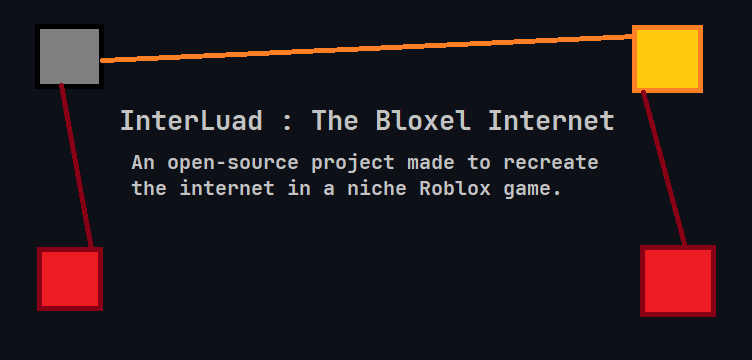

<div align="center">
  
  <h1>InterLuad</h1>
</div>

An open source project for the Roblox game [Bloxel](https://www.roblox.com/games/1427028360/Bloxel) that partially recreates the internet.

This repo assumes you already have a decent understanding of Bloxel's computer system and some basic programming knowledge. If not, please check the [Bloxel Wiki](https://bloxel.miraheze.org/wiki/Technology_Blocks), read up on it in the [Discord](https://discord.gg/wMfVhfD), or check out [this User's video](https://bloxel.miraheze.org/wiki/Technology_Blocks#Tutorial) on the topic.

There is also a branch of this repo with encryption support, called [DHTP](https://github.com/GirlInPurple/interluad/tree/diffie-hellman-transfer-protocol). This repo is still under heavy development, so please check [the releases](https://github.com/GirlInPurple/interluad/releases) for working versions. I should also mention that all examples on the repo are based on the newest version of Interluad only, no forks or modifications (unless specified)

## How it works

3 things are needed to get this working:

- Connecting lines 32 blocks apart, the max distance a port can extend. They can be decorated however the builder likes and generally follow the highways built by the [HBA](https://bloxel.miraheze.org/wiki/HBA)
- Repeater Stations to separate and handle all the connections between clients
- Multiple clients connected to Repeater Stations, referred to as Connectors in this project


### Repeater Stations

Here is a simplified breakdown of the code;

- The Master Computer of the station gets sent a JSON, the first value of which is a 4 character long string
  - 26 + 26 + 10 + 5 = 67<sup>4</sup> = 20,151,121 unique addresses, we're not going past 100 connected at once, let alone 20 million. We wont get into a IPv6 situation for a *long* time, if ever.
  - The [DNS System](./dnsServer/dns.lua) uses only "1"-"9998", no letters or special chars. Again, we wont need nearly 10k addresses.
- It then sends the JSON back down all of the wires connected to the station, eventually reaching its destination, even if it is astronomically slow.
  - There is no built-in DDos protection, so the network could encounter an infinite loop if the other station send it back down the original wire.

### Connectors

Anything that gets sent to the Connector with a valid first value will be sent out to the rest of the world. Anything that it receives will be sent to all attached ports.

It is recommended to use a Computer instead of a Laptop to use as a Connector, as the more ports you have the better.

### DNS

There is only one DNS server on the map, near the InterLuad Testing Site, and its purpose is to give out new addresses to [DNS Connectors](./connector/connectors.md).

Using one inside a local network may be a good use case as well, explained [here](#local-networks)

### JSON Format

The json is more-or-less completely handled by the Connector, but if you want to write your own, here is the base format;

```json
{
  "adrs":"2", // target address
  "from":"1", // your address, added automatically if sending
  "encrypt":{
    // explained in the DHTP branch
    // if sent a json with the exact value of "encrypt", it will be added here instead
  },
  "content":{
    // if sent a json, it will be added here
    // if sent a value, it will be added here in array form
  }
}
```

On incoming packets, the whole packet will be sent out

## Limitations

Currently, there are 4 limitations to this project:

- Roblox's censoring system messing with most, if not all, user outputs; although this is just a fact of life on the site
- The 800 character limit but people have worked around it so its not too bad
- The 32 block limit between ports, not much of a limitation but its notable. Maybe make them look like power lines?
- Computers completely stop working when [out of render distance](https://discord.com/channels/516034689895759872/1066220531910721656/1171559941534924880), making repeater stations and clients with unloaded chunks between them completely useless.

## Tutorials

Here are a few tutorials for how to build/set up certain features of InterLuad. It will get more complex the farther down you go, but it shouldnt be too bad.

This section is still a work in progress, feel free to submit a PR to edit this section. Images will be added later.

### Lines and Stations

Lines are very simple, they are just [splitters](https://bloxel.miraheze.org/wiki/Splitter), 28-32 blocks apart, high off the ground, built alongside highways and usually look like [low-voltage](https://en.wikipedia.org/wiki/Overhead_power_line#Low_voltage) or [compact transmission](https://en.wikipedia.org/wiki/Overhead_power_line#Compact_transmission_lines) lines.

Stations, however, are more complex;

### Connections

The connection system is simple, just getting it linked up and working is the issue, especially if you're using it as a front facing system for a [local network](#local-networks).

First choose a [connector](./connector/connectors.md) to use, then;

#### No Filter

Just copy-paste the contents of your connector of choice, link up ports 1 and 2, and let it run. You will be detected eventually by the DNS system, and your address logged. Its best to

#### Filter / DHTP


### Local Networks

### Safe Modifications

## Contributing and License

There is a test site in the works, a little east of `!tp spawn3`. No waypoint or builds there as of now.

The [Python file](./checkAndCompile.py) is for making sure that there are not immediate issues in the latest commit, like how many ports you are using and the length of the file. This will run automatically and can be viewed [here](https://github.com/GirlInPurple/interluad/actions).

MIT license cause no need to lock down the code, any commits will be under MIT as well
